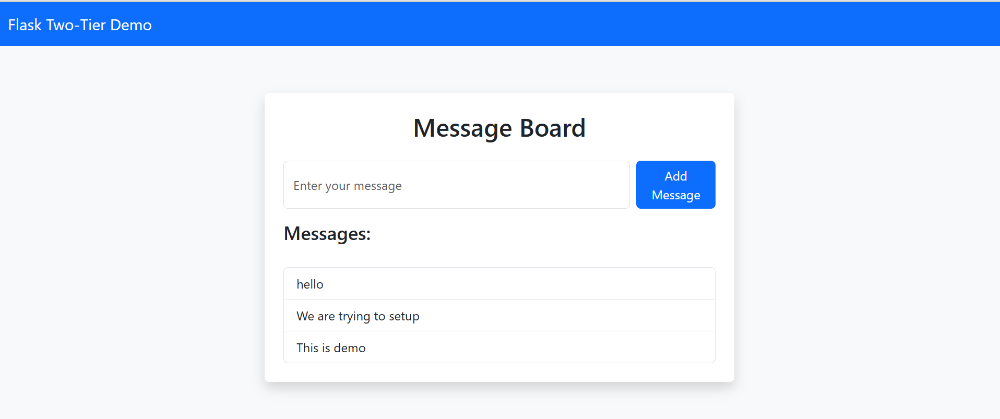

# Flask App



```bash
 sudo usermod -a -G docker ubuntu
 docker ps -a
 newgrp docker
```


```bash
 docker network ls
 docker network create mycustom -d bridge
 docker ps
 docker stop b786 && docker rm b786
 docker network ls
 docker run -d --name mysql --network mycustom -e MYSQL_ROOT_PASSWORD=passwd  -e MYSQL_DATABASE=devops mysql
 docker ps
 docker run -d --network mycustom -p 5000:5000 -e MYSQL_HOST=mysql -e MYSQL_USER=root -e MYSQL_PASSWORD=passwd -e MYSQL_DB=devops flask-app
 docker ps
 docker exec -it mysql bash
```
